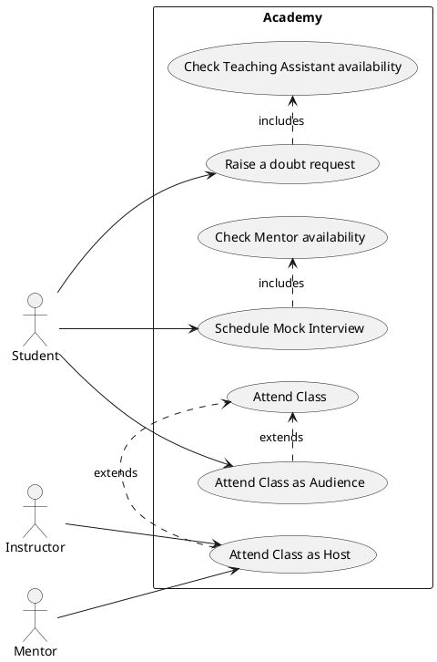

### UML Diagram for Tuition Academy

Actors -
* Student
* Instructor
* Mentor
* TAs

Use Cases -
* Attend Class
* Schedule Mock Interview
* Raise a TA request

### UML Diagram

We will use PlantUML to create the UML diagram. Below is the PlantUML code for a sample scenario from a tuition academy:

